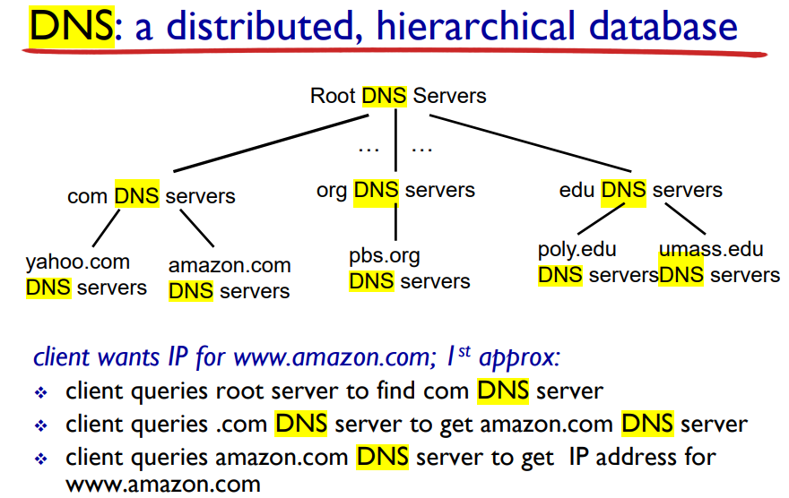
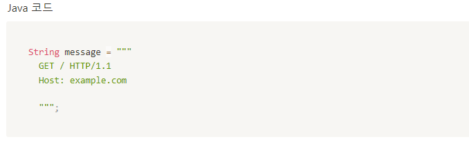

# HTTP client

**TCP / UDP**

앞서 적은 대로 전송 계층에서는 TCP / UDP 프로토콜을 통해 프로세스 간 통신이 이루어진다

TCP : handshake 과정이 존재하여 연결수립을 보장하고 순서가 잘못되면 재전송 요청을 보내는 등 패킷 순서를 보장, 그외에도 흐름 제어, 혼잡 제어 등이 있는 신뢰할 만한(reliable) 전송 방식이다

UDP : TCP와 달리 handshake나 순서보장 등이 일절 없이 오류 확인을 위한 체크섬 정도만 존재

이러한 특성 때문에 신뢰성보다 실시간으로 빠른 전송이 필요한 경우에 주로 UDP, 그 외엔 TCP를 사용하는 것이 일반적이라고 배웠으나, 최근 들어 HTTP/3 에서는 UDP를 발전시켜 TCP의 신뢰성까지 탑재하는 식으로 사용된다고 한다

**소켓(Socket)**

소켓은 프로세스 간 통신시의 출입구 역할을 하며, 클라이언트 서버 둘 다 소켓을 열고 있어야 통신이 가능하다

소켓을 통한 클라이언트 - 서버 간 통신 순서 :&#x20;

1. 서버 측에서 클라이언트의 접속 요청을 듣기 위한 listen 용 소켓을 하나 연다
2. 클라이언트가 해당 서버에 접속 요청을 보내어 소켓이  연결됨(connect)
3. 서버 측에서 요청을 받아들이고 해당 클라이언트와의 통신을 수행할 별도의 소켓을 연다(accept)
4. 클라이언트의 기존 소켓과 서버가 새로 연 소켓 간에 데이터 전송이 이루어짐 (send / receive)
5. 전송이 모두 끝났으면 각각의 소켓을 닫음 (close)

TCP 통신의 경우 연결 수립을 위한 3-way, 연결 종료를 위한 4-way handshake 과정도 존재함

socket API는 소켓 간 연결 및 통신에 대해 프로그래밍 하는데 사용되는 것임 (소켓과는 다르다!)

**호스트(host)**

호스트란 네트워크를 통해 다른 네트워크에 연결된 장치와 통신 가능한 컴퓨터 등의 장치를 뜻한다

다른 호스트와의 구별을 위해 IP 주소를 이용하며, 앞장에서 적은 도메인은 각 IP주소들을 사람들이 알아보기 쉬운 형태인 www.\~\~\~.com 같이 표현하여 등록하고 관리하여 사용한다

DNS(domain name system)은 도메인 명 <-> ip 주소 간 변환을 수행하는 역할을 가진다

&#x20;                                              

DNS 서버들은 root에서 내려오며 점점 분산되는 형태로 존재하며, 사용자가 특정 사이트의 DNS 명을 요청하면 그에 맞는 DNS 서버까지 내려오고 해당 서버가 응답해주는 형태로 진행된다

포트 번호(port) : TCP / UDP 등의 "프로세스 간" 통신에서 어느 프로세스와 통신을 진행할 것인지를 정해기 위한 번호이다

0번부터 65535 번까지 있으며 앞의 1023 번호까지는 사용처가 정해져 있으며(ex: HTTP -> 80번),

&#x20;임의로 사용하기 위해서는 1024 \~ 49151 번이 사용됨 (그 뒷 번호들도 사용처가 정해져 있다고 함)

경로(path) : 말 그대로 특정 파일의 위치를 알려주긴 위한 주소로, 디렉토리/디렉토리/파일명 이런 형태로 쓴다

앞서 적은 URL의 경우 정확한 표기 형태는

**protocol://domain:port/경로/파일명.확장자?key1=value1\&key2=value2#hash**

처럼 되고, 맨 뒤의 key=value 는 서버에 제공할 정보인 parameter를 표현하는 형태이다

**Java text blocks**

<figure><figcaption></figcaption></figure>

client 코드에서 message 입력 시 사용했던 """ \~\~\~ """ 형태를 뜻함

복수 줄의 문자열을 한번에 입력하기 좋다

**Java InputStream과 OutputStream**

자바는 stream을 통해 IO 작업을 수행함, stream은 일방향이라 동시에 입출력을 모두 처리할 수는 없음

InputStream과 OutputStream은 각각 Bytes 단위 입 / 출력을 위한 최상위 입출력 추상클래스이다

OutputStream의 경우 출력이 모두 끝난 뒤에도 버퍼에 데이터가 남아있을 수도 있어 flush()를 붙여줘야 한다

(예제 코드에서 사용된 Reader / Writer 클래스의 경우 "문자" 단위  입출력 최상위  stream 클래스)

**Java try-with-resources**

예제 코드에서 사용됐다시피 특정 구문을 try 로 묶고, 그 안의 객체들에 대하여 try 종료 시 자원까지 자동으로 해제되도록 해준다

강의 내용처럼 try를 쓰지 않을 경우 선언한 stream 객체들에 대하여 .close()를 수행해줘야 하나 try-with-resources로 묶으면 그러한 귀찮은 작업을 줄일 수 있다

