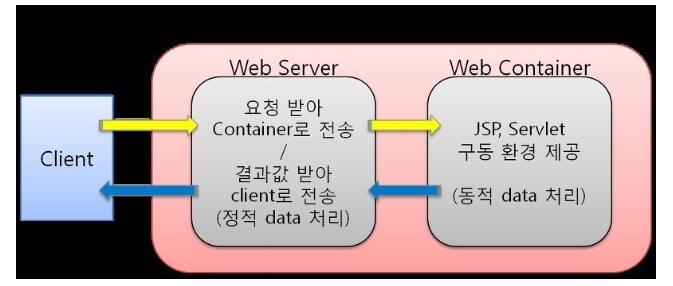

# Spring web MVC

**Spring**

Spring 프레임워크는 java application을 쉽게 만들기 위한 프레임워크로, 모듈로 나누어져 있어 필요한 모듈들 만을 선택하여 사용할 수 있고 이전 버젼과의 호환성이 높아 어플리케이션 및 라이브러리의 유지보수를 용이하게 한다

또한 스프링은 javadoc에   의미있고 최신이며 정확한 정보를 담으려 함으로써 코드 품질에 대한 높은 기준을 부여하여, 패키지 간 순환 참조가 없는 깨끗한 구조의 코드를 요구할 수 있게 한다

**Spring Boot**

스프링부트는 사용자가 스프링으로 프로젝트를 만들고시작(boot)할 때 필요한 사전 설정 등을 자동으로 처리 혹은 단순화 시켜주는 프레임워크이다

**Spring initializer**

스프링 프레임워크에서 빌드, 언어, 버젼 등을 선택하고사용할 라이브러리를 검색을 통해 쉽게 찾고 추가할 수 있게 해주어 프로젝트 생성을 도와주는 웹 도구이다

**Web Server와 Web Application Server(WAS)**

웹 서버는 클라이언트로부터 http 요청을 받으면 그에 대한 이미지 파일이나 html 문서 같은 단순하고 "정적인" 컨텐츠를 제공한다

WAS는 DB 조회 등을 요구하는 더욱 복잡하고 동적인 컨텐츠를 클라이언트에게 제공하기 위한 Application server이다

<figure><figcaption></figcaption></figure>

Tomcat이 WAS의 대표적인 예이며 java 기반이다

**Model-View-Controller(MVC) 아키텍처 패턴**

application을 3가지 컴포넌트로 나누어 각자가 고유의 역할을 수행하도록 하고 결과물을 다른 컴포넌트 혹은 유저에게 넘긴다

그 결과 관심사의 분리를 통해 UI와 비즈니스 로직을 분리

1. View : 사용자에게 보여지는 부분(GUI)
2. Controller : 사용자의 입력에 대한 처리, 요청에 대해 view와 model에게 필요한 내용 전달
3. Model : 앞의 둘을 제외한 나머지 부분, 변수나 상수 데이터 등

\-관심사의 분리(Seperation of Concern) : SW 개발 원칙 중 하나로, 소프트웨어를하나의 커다락 block으로 만들지 말고 관심사 별로 블록을 나누는 것이다

이렇게 함으로써 특정 관심사에 대한 이슈가 생겨고 그에 맞는 block 위주로 확인하면 되니 유지보수가 편해지고, 각 관심사에 따라 개발 인력을 배치하기도 좋다

**Spring MVC**

spring에서 제공하는 servlet 기반의 웹 개발용 프레임워크로, 위의 MVC 패턴을 기반으로 MVC 세가지 컴포넌트를 기반삼고이를 보조하는 컴포넌트들로 구성된다

<figure><figcaption></figcaption></figure>

여기서 주요 컴포넌트들이 각 역할은,

* Dispatcher Servlet : 클라이언트의 request를 controller로 전달, 전달받은 결과값을 view로 보내서 알맞는 response를 생성하게 함
* Handler Mapping : request 정보와 url 가지고 어떤 handler 객체 호출할 지 결정
* Handler Adapter : Controller에서 url에 알맞는 method 선택
* Controller : request 처리하고 model에 결과값 전달할 객체 저장, view name을 dispatcher servlet에 전달
* view resolver : 결과값 대한 view 생성
* view : 결과 화면 response로 클라이언트에게 보냄

**Java Annotation**

@override 같이 앞에 @를 붙여서 사용하는 메타데이터의 일종으로 다양한 기능들이 존재하고, 잘못 사용시 컴파일 에러를 일으킨다

**Spring Annotation**

Spring 프레임워크에서 쓸수 있는 annotation들이다

* @Controller : 해당 클래스가 Controller 역할을 한다고 spring에게 명시하는 annotation
* @ResponseBody : response할  내용이 view로 출력되지 않고 HTTP Response Body에 직접 담김
* @RestController : 위 둘이 합쳐진 형태로 해당 클래스를 Controller로 잡고 response 내용을 HTTP Response body에 담아서 보냄
* @GetMapping : 해당 annotation 뒤에 () 안에 경로를 쓰면 해당 경로에 대한 GET 요청을 해당 메소드와 매핑시킴
* @RequestMapping : () 안에U value와 method 둘에 대해 입력하는데, value는 URL, method는 요청 메소드 종류에 대해 지정하여 매핑시킴

