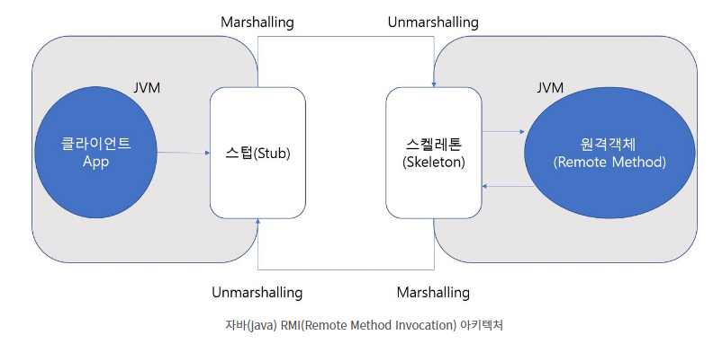

# 직렬화

**직렬화(Serialization)**

객체는 캡슐화 되어있어 그대로 DB 등에 저장하는 건 불가능하기 때문에 알맞는 형식으로 변환하는 과정이다

역직렬화(Deserialization)은 반대로 변환했던데이터를 원본  형태로 다시 변환하는 과정이다

**마샬링(marshalling)**

직렬화랑 마샬링은 보통 동일시 되나 자바에서는 마샬링을 특별하게 다룸

마샬링 : 직렬화와 거의 같으나 기존 객체의 상태와 코드 베이스를 저장한다

코드 베이스는 해당 객체의 구현의 위치에 관한 정보를 담고 있으며, 마샬링은 이러한 정보들을 가지고 있기 때문에 다른 JVM에 마샬링을 통해 데이터를 보내주면 원격으로 해당 객체를 원래 상태로 복원(언마샬링)할 수 있다

<figure><figcaption></figcaption></figure>

앞서 정리한 RMI의 구조에 대한 도식으로 원격 메서드호출에 관하여 데이터 변환(마샬링 / 언마샬링)이 이뤄지고 있음을 확인할 수 있다

**JSON(Javascript object notation)**

자바스크립트 객체 문법으로 구조화된 데이터를 표현하기 위한 문자 기반 표준 foramt으로, 사람이나 기계 모두 읽고 쓰기 용이하다는 장점으로 인해 대부분의 백엔드 \~ 프론트엔드 사이 통신 시에 사용되고 있다

{ } 안에 키 : 값 쌍이 포함되는 형태이다

자바스크립트에선객체로 그대로 사용가능하고 자바에선 json 위해 map 쓸수도 있으나 타입 안정성 등 위해 보통 DTO 형태로 매핑하여 사용한다

Jackson 라이브러리를 통해 JSON을 Object로 변환 가능하며 스프링부트의 경우 web 의존성 추가 시 바로 사용가능

