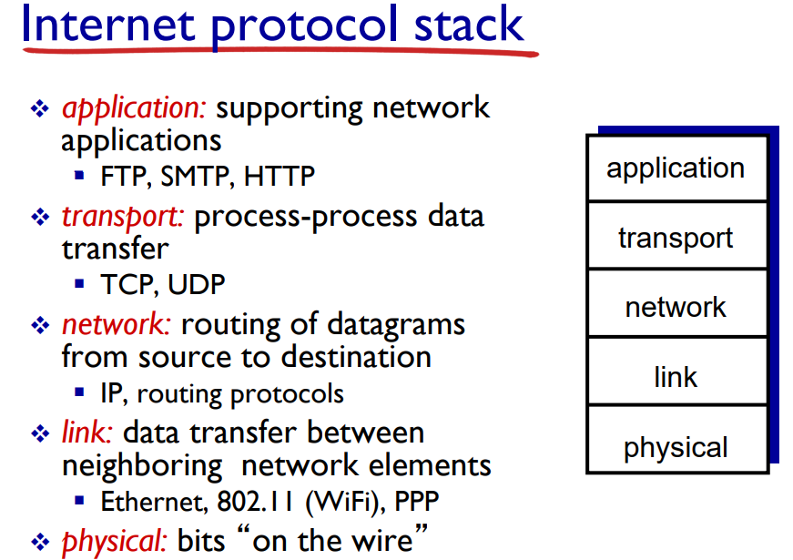
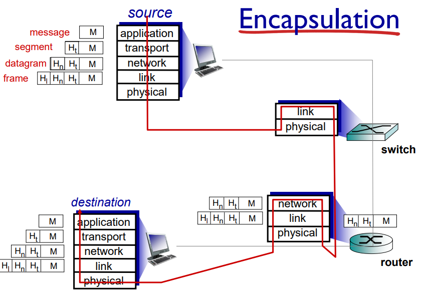

# HTTP의 이해

\-**HTTP(hypertext transfer protocol)** 이란 하이퍼링크를 통해 다른 문서로 이동 가능한 하이퍼텍스트의 전송을 위한 규약으로,&#x20;

하나의  서버에 여러  클라이언트가 요청을 보내면 중앙의 서버가 각각에 맞는 응답을 보내주는 서버 - 클라이언트 아키텍쳐이다

웹사이트 주소의 맨 앞부분 http:// 가 위의 http 가 사용된다는 뜻이다 (https의 경우 보안을 위해 tls 같은 암호화 통한 보안을 적용했다는 뜻)

보통 우리가 주소라 부르는 내용은 URL(uniform resource locator)로, 웹 상에서 특정 리소스에 접근하기 위한 위치를 선정해 주는 것이라 볼 수 있다 (앞의 http:// 부분은 프로토콜을, 뒤의 www 부분은 도메인)

예를 들어 내가 도메인 등록 사이트에서 http://www.khw.com 을 등록하고 이것이 접수되었다면, 내가 개인적으로 만든  프로젝트 서버의 ip주소를 해당 도메인에 연결해 두면 온라인 상 다른 누군가가 저 url을 입력하면 프로젝트 리소스에 접근 가능해 진다

**OSI 7계층 모델**:  국제표준화기구(ISO)에서 만든 컴퓨터가 네트워크를 통해 통신할 때 규약(protocol)을 7 계층으로 나누어 표현한 모델

위에서부터 application - presentation - session - transport - network - link - physical로 나누어지나,&#x20;

인터넷 (TCP / IP) 프로토콜에서는 위의 3계층을 묶어 하나의 application 계층으로 본다

5계층이든 7계층이든 위에 있을수록 사용자에 가깝고, 아래로 내려갈수록 하드웨어적인 low - level 계층이다

&#x20;                                          

인터넷 프로토콜의 맨 윗 계층인 application 계층은 응용 프로그램, 서비스 등에 대한 계층으로 위에 정리한 HTTP를 비롯해 파일 전송이나 메일을 위한 프로토콜인 FTP, SMTP 등이 포함된다

그 밑의 transport 계층은 "프로세스 간" 데이터 전송을 담당하여  이를 위해 포트번호를 이용하고 TCP, UDP가 여기에 해당된다

network 계층은 출발지에서 목적지 까이즤 라우팅을 담당하는데, 여기서 라우팅이란 목적지까지 이동하면서 거치는 노드들에 대한 교통정리, 즉 길찾기를 해주는 것이다

이러한 길찾기 과정을 위해 IP 주소가 사용된다

link 계층은 인접 네트워크 (= 같은 공유기에 묶여있다던가)  간 데이터 전송을 위한 것으로, 컴퓨터 내 랜카드 별로 고유값을 지닌 MAC주소를 통해 통신을 진행한다

physical 계층은 말 그대로 전기신호가 왔다갔다하는 물리적인 계층이다

&#x20;                                             

위 사진처럼 출발지에서는 application -> \~\~\~ -> physical 순으로 내려가서 데이터가라우팅 등의 과정을 통해 여러 노드를 거치고 목적지에 도착, physical부터 위로 거슬러 올라 application 단에서 상대방이 확인하게 됨

HTTP는 "**stateless**" 하다 = HTTP 통신에서 서버 측은 과거 클라이언트 요청에 대한 정보를 따로 저장하지 않음!

따라서 서버측이 클라이언트 간 구분을 하기 위해 쿠키 / 세션 등이 사용됨

쿠키 : 클라이언트 측에서 저장하고 클라이언트 브라우저에서 관리하는 작은 데이터로, 요청 시 알아서 헤더에 넣고 서버측에 보냄

세션 : 서버가 각 클라이언트 별로 고유 key를 부여하고, 클라이언트들은 그뒤로 서버에 요청을 할 때마다 key값을 같이 넣어서 보내고 이를 가지고 서버측에서 구분 -> 서버와 클라이언트 둘 다 key값을 저장함

**HTTP 메세지**&#x20;

http 메세지란 서버 - 클라이언트 간 통신 시 주고받는 데이터에 포함되는 메세지로 시작줄 / 헤더 / 빈 줄 / body 형태로 구성된다

시작줄에는 요청일 경우 요청의 종류(get, post 등)가 무엇인지, 응답이면 상태코르를 통해 성공했는지, 어떤 이유로 실패했는지 등을 표현한다

헤더에는 호스트 주소, 연결 방식, content 타입과 길이 등의 다양한 정보들이 들어간다

공백 : 필수인 이유는 아마 헤더와 body 사이를 구분하기 위해서 필요한 것 같다

body : 메세지의 "본문"에 해당하는 부분으로, GET같은 요청이라면 body가 비어 있을 수도 있음

단일 body일 경우 헤더의 content type / length에 적힌 대로의 본문이 들어갈 것이고

multipart/form-data 를 이용하면 하나의 body에 여러 타입의 데이터가 들어갈 수 있다

**HTTP 요청 메서드**

클라이언트 측에서 서버에게 어떤 종류의 요청을 하는 것이라고 알리기 위해 http 메세지에 넣어 보냄

종류는 GET, POST, DELETE, PUT, HEAD 등이 있으며&#x20;

GET은 서버측에 특정 리소스를 조회하고 싶다 요청하는 것이고, POST는 클라이언트가 서버에게  데이터를 전송하여 정보를 추가시킨다

\-**멱등성** : http 메세지 중에 같은 종류의 요청을  여러 번 보냈을 때 매번 같은 결과가 돌아오고, 서버의 상태도 동일할 경우 멱등성을 가진다 or 멱등성이 성립한다 라고 부른다

ex) 서버에 변경사항이 없으면 몇번 get 요청을 보내도 같은 결과가 돌아오므로 get은 멱등성 존재,

post는 매번 보낼 때마다 새로운 정보로 취급하여 추가되므로 멱등성 X

put의 경우 DB의 update 처럼 하나의 정보를 갱신하는 것이므로 결과가 같아짐 -> 멱등성 O

**HTTP 상태 코드**

서버가 클라이언트의 요청을 받고 그에 대한 응답을 보낼 때 응답 상태에 관하여 정해진 코드를 가지고 클라이언트에게 알려주기 위해 보냄

세자리 숫자로 구성되어 있으며 앞자리에 따라 카테고리가 나뉨

1XX : 요청은 받았고 작업이 진행중이라는 정보를 알림, 어지간하면 쓰일 일이 없다고 함

2XX : 요청에 대한 응답 성공! 200은 OK로 그냥 성공했다는 의미, 201 created는  주로 post 같은 요청에 대한 리소스 생성이 성공했다는 의미로 쓰인다

3XX : 리다이렉션(redirection)에 대한 상태 코드로, 요청에 부응하려면 추가적인 작업 즉 페이지 이동이 필요하다는 의미이다

예를 들어 클라이언트가 www.khw.com 을 요청하면 서버 측에서 이를 받고 제대로 된 응답을 하기 위해 요청 url을h khw2.com 으로 재지정(redirect)하여 다른 페이지로 이동하겠다고 하는 것이다

리다이렉션의 종류는 크게 3가지로 나뉘는데 url이 영구적으로 이동하는 영구 리다이렉션, 일시적으로만 이동하는 일시 리다이렉션, 클라이언트가 요청한 url에 대해 캐시에 저장된 것과 같다면 캐시를 리다이렉션하는 특수 리다이렉션 3종류가 있다

4XX : 클라이언트 쪽 문제로 실패한 경우에 사용되는 코드

5XX : 서버 쪽 문제로 실패한 경우에 사용되는 코드

****

